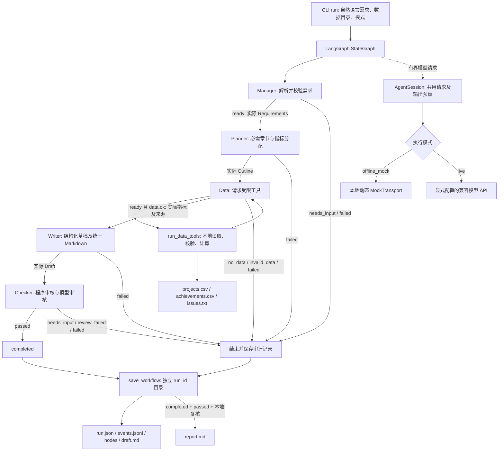
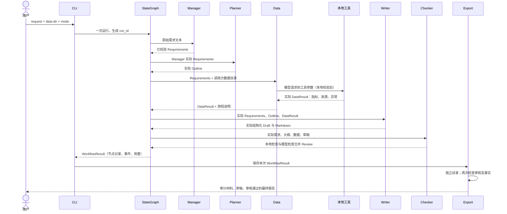

# v0.4 五角色工作流架构

本版将 v0.3 的独立角色函数接入真正的 LangGraph StateGraph。图中的后续节点使用前一步实际返回的对象；`agent-demo` 仍是角色示例入口，`run` 才是完整编排入口。系统单进程运行，不包含消息队列、并行模型执行或自动返工。

## 组件及边界

Manager 和 Planner 无数据工具权限。Data 只能请求 `run_data_tools`，参数限于已校验的部门与日期，路径由调用方绑定。统计值由本地工具计算；Writer 和 Checker 不能把模型文字作为权威统计结果。未经部门和日期筛选的 `issues.txt` 不可归因于本次范围。

`WorkflowResult` 保存需求、大纲、Data 结果、权威指标及来源、数据问题、草稿、审核、真实节点输入输出和事件。每个节点记录实际开始与结束时间、耗时和结果；模型与工具事件来自实际调用。节点耗时不是单次 HTTP 耗时。

## 正常执行时序

正常链路执行 6 次模型请求：Manager、Planner、Writer、Checker 各一次，Data 工具请求和工具结果说明各一次；本地工具执行一次。需求不足在 Manager 终止，数据不足或非法在 Data 终止；任何节点失败终止后续执行。审核拒绝保留标记的草稿，`report.md` 只在通过门禁后产生。v0.4 的 `revision_count` 固定为 0；v0.5 再实现有限返工，不在当前图中画未来循环。

## 离线与真实模式

离线模式使用脚本响应和动态上下文，验证编排、工具计算、传递及程序审核，不能证明模型理解和写作能力；它不加载 `.env`，不发网络模型请求。真实模式明确启用 API，共享会话限制请求总数和输出预留量，禁用重试及 DeepSeek 推理输出。存档只保存校验后的业务输出与安全摘要，不存密钥、原始响应体或推理内容。

模拟样例来源应显式标记为 `simulated`，用户材料标记为 `provided`。终端文本和 JSON 是审计证据，实际运行截图需另外截取，不能用日志代替截图。图中的协作角色是软件和 AI 开发协助角色，并非三名人类组员。
