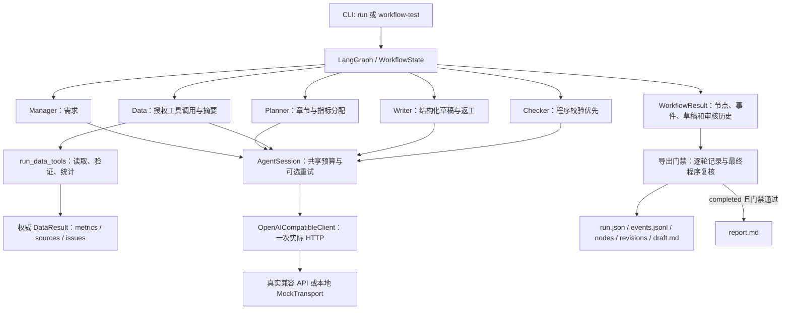
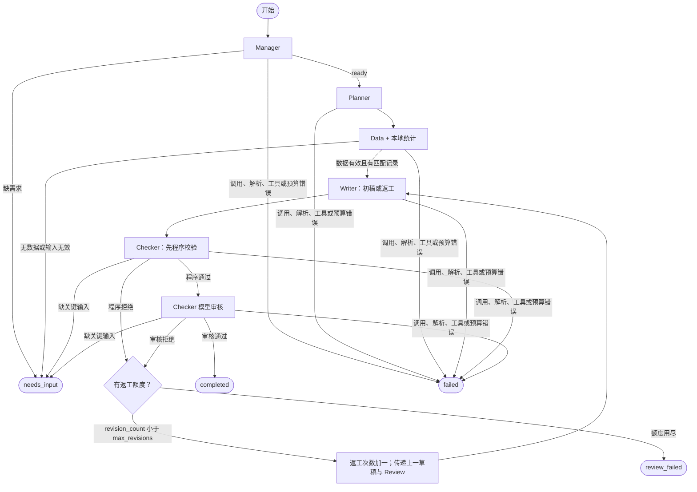
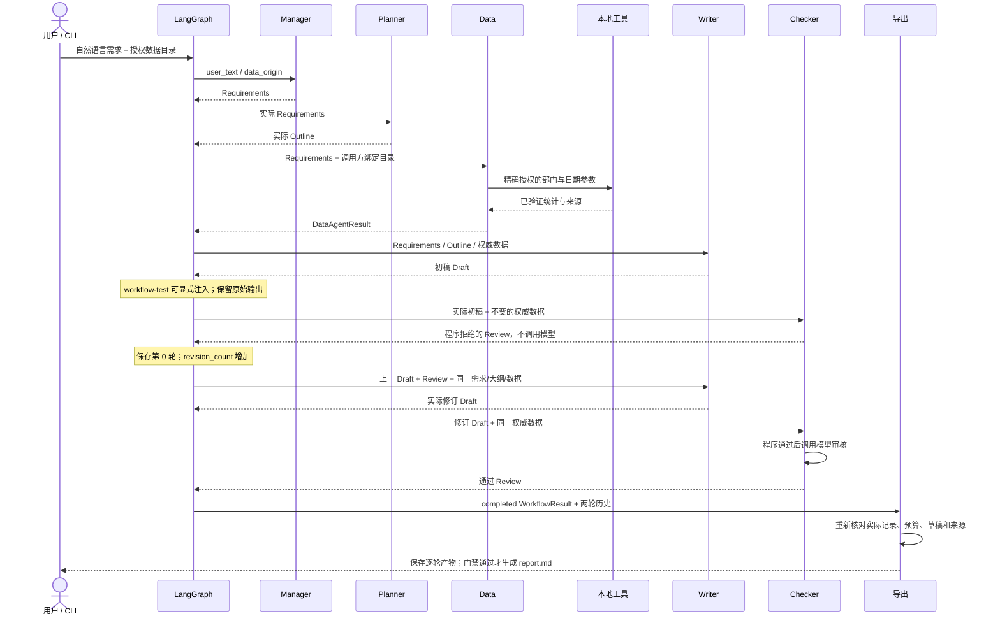

# v0.5 架构、状态与时序

当前实现以单进程 LangGraph 编排五个角色，统计来自本地确定性工具。首次生成后可有最多两次实际 Writer 返工；网络重试由同一 Session 另行管理，不重新执行业务图。

## 模块边界



`workflow.py` 负责条件边和状态；`workflow_schemas.py` 负责契约；`agents/writer.py` 与 `agents/checker.py` 负责草稿和审核；`agent_runtime.py`、`llm.py` 负责模型请求；`workflow_export.py` 负责保存和最终门禁。`workflow_examples.py` 的模拟响应根据真实节点上下文生成，不把独立 `agent-demo` 的固定样例当作完整工作流。

## 实际路由



初稿轮次为 `revision_index=0`，返工为 1、2。`max_revisions` 允许 0/1/2；`revision_count` 在 Checker 路由到下一 Writer 时增加，表示已开始的返工尝试，不保证已生成新草稿。最后一次 Writer 或 Checker 失败时，保留失败节点和之前已存在的草稿、审核。

## 一次错误后修复的时序



该图示的是允许一次修复的路径；持续错误会再次返工，第二次之后仍拒绝则停止。真实模型可能拒绝表达或建议，也可能调用失败，不保证按示意路径成功。

## 不变数据与报告约束

Manager 的输出驱动 Planner，Planner 的输出驱动 Writer。Data 以 v0.2 的本地工具计算四项指标，保存来源文件 SHA256 与实际行号。节点输入和输出均深复制为独立审计快照；给 Writer 和 Checker 的数据副本不能改写共享权威值。

完整 `run` 启用 `narrative_policy=constrained`：章节正文逐字使用 `allowed_section_texts` 中的范围说明；核心数字由 `fact_claims` 渲染，逐项核对数值、单位、来源、归属和完整性。错误模型输出保留后拒绝，不静默改成正确值。建议是尚未实施的行动，待人工评估；未筛选的问题材料不能被归因于当前部门或期间。独立 `agent-demo` 保留 freeform 兼容样例，不具有完整工作流的严格正文保证。

## 业务返工与网络重试

| 项目 | 业务返工 | 网络重试 |
| --- | --- | --- |
| 触发 | Checker 审核拒绝且材料完整 | 指定连接/超时异常、429 或 5xx |
| 执行范围 | Writer → Checker | 同一模型请求再发送一次 |
| 额度 | `max_revisions`，最多 2 | `retry_budget`，默认 0，全局最多 2 |
| 每次上限 | 每轮 Writer 768、Checker 256 输出预留 | 每逻辑请求最多重试一次，仍消耗请求与输出预算 |
| 记录 | `revision_count`、`revision_history`、节点轮次 | `retry_count`、`model_retry`、每次 `model_request` 的 `attempt` |

`request_count` 是实际 HTTP 尝试数，包括失败；`logical_request_count` 是通过本地参数检查的调用意图数，预算拦截时可无 HTTP；正常完成时等于 `attempt=1` 的 HTTP 数。预算检查在每次 HTTP 前执行，重试等待失败不被记为一次实际重试。Session 中 Adapter 的内部重试固定为零，避免绕过总预算。

五角色正常链路为 6 个逻辑请求、1984 输出预留；允许两次返工最多 10 个、4032 输出预留。再允许两个最耗输出的 Writer 请求重试时，硬上限为 12 次 HTTP 和 5568 输出预留。预留 token 上限不等于实际用量；输入另计。HTTP 失败或 usage 缺字段时，累计字段为 `null`。

## 审计文件与最终门禁

```text
outputs/<run_id>/
  run.json
  events.jsonl
  nodes/01-manager.json ...
  revisions/00/draft.md
  revisions/00/review.json
  revisions/01/draft.md
  revisions/01/review.json
  revisions/02/draft.md
  revisions/02/review.json
  draft.md
  report.md  # 仅 completed 且门禁通过
```

只保存实际存在的轮次；尚未审核的草稿可以保存，但不伪造 `review.json`。节点包含轮次、真实输入/输出、起止时间、耗时与安全错误；故障实验另存原 Writer 输出及 `error_injected` 事件。目录使用规范 UUID，已存在则拒绝覆盖。

导出重新检查所有历史中的固定需求、数据、草稿与审核对应关系；核对请求事件和独立预算计数，要求最终 Checker 模型尝试成功，再执行严格程序校验。其他终态仅保存草稿和记录，不导出最终报告。导出拒绝后记录保留，不伪造业务成功。

这是本地课程原型，没有后台队列、持久图恢复、并发共享 Session 或日志签名。Mermaid 架构与时序图是代码说明，不是运行截图；课程要求的截图、最终报告和真实验收证据需要按实际运行结果单独准备。
