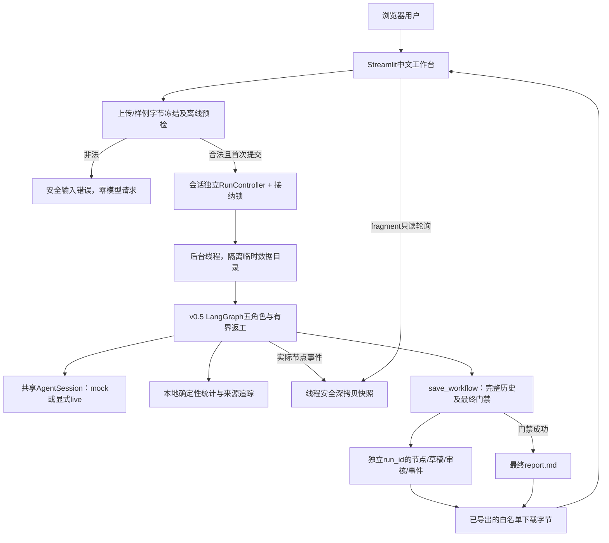
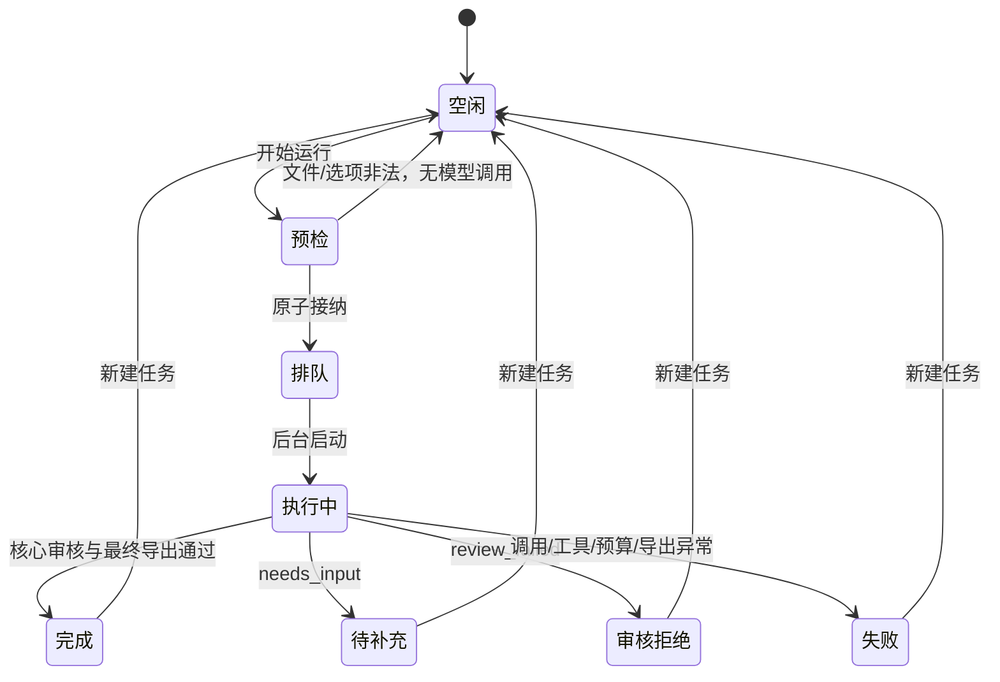

# v0.6 页面与后台架构

页面主入口app.py调用web_ui；业务契约web_schemas；上传服务web_uploads；后台服务web_runtime。UI不持有模型Client，不复制另一套工作流。默认mock仍实际执行图、文件统计、程序审核和导出；只有HTTP响应为本地脚本。

RunController存放在每个session_state中，不把含业务数据的控制器作为全局缓存。start在锁内只接纳一个任务，所有后续start被拒绝，包括已经结束的任务；显式reset只在终态允许。后台线程不调用st，避免页面重运行打断已接纳任务。fragment轮询只读深拷贝结果与事件，不能触发请求，下载使用已生成bytes，不从页面输入读取服务器路径。

输入冻结为三个固定文件的immutable bytes，上传和样例都验证全量数据；运行临时目录只写白名单，执行结束清理。每次模型会话、指标、事件、源SHA和产物UUID独立。CSV解析对进程全局field_size_limit修改/解析/恢复加锁，避免并行预检/多会话竞态；它不会让模型调用全局串行。

run_workflow的可选on_event观察者在角色动作前收到node_started，角色结束后收到实际HTTP/tool/finished。事件深拷贝，观察器异常不会改变审计或重放请求。节点内部HTTP进度在节点结束后公开；页面不伪造工具执行，也不对耗时推测百分比。v0.5 schema_version仍描述核心工作流格式，项目版本0.6.0描述新增网页层。

completed只有save_workflow复核成功后才提供final下载；导出异常把网页任务标记failed并撤下下载，不能把核心图的中间completed当作交付成功。异常采用静态安全提示，输入/原服务错误正文、推理内容和配置密钥不出现在错误信息里。

本机单进程原型不实现持久任务队列、身份权限或日志签名。新的浏览器会话、服务重启和跨进程请求不在本次防重复保证范围内。实际测试与截图索引见 [validation-v0.6](validation-v0.6.md)。
