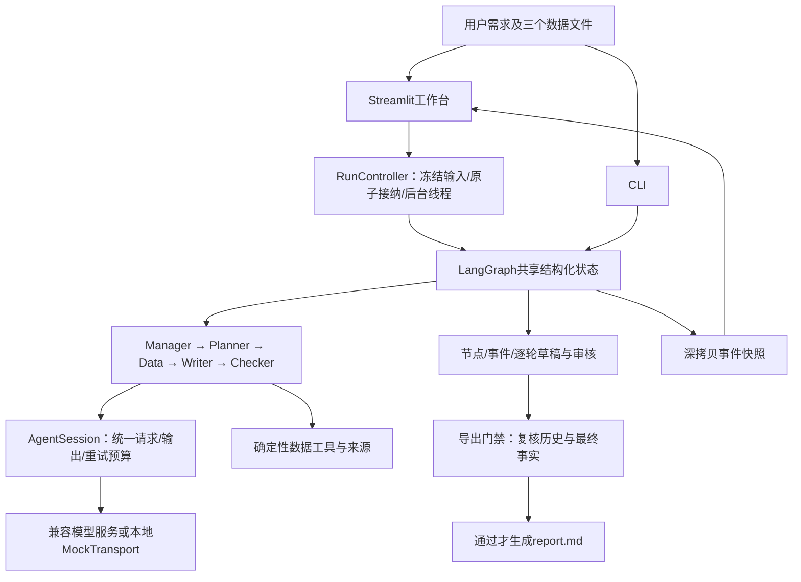
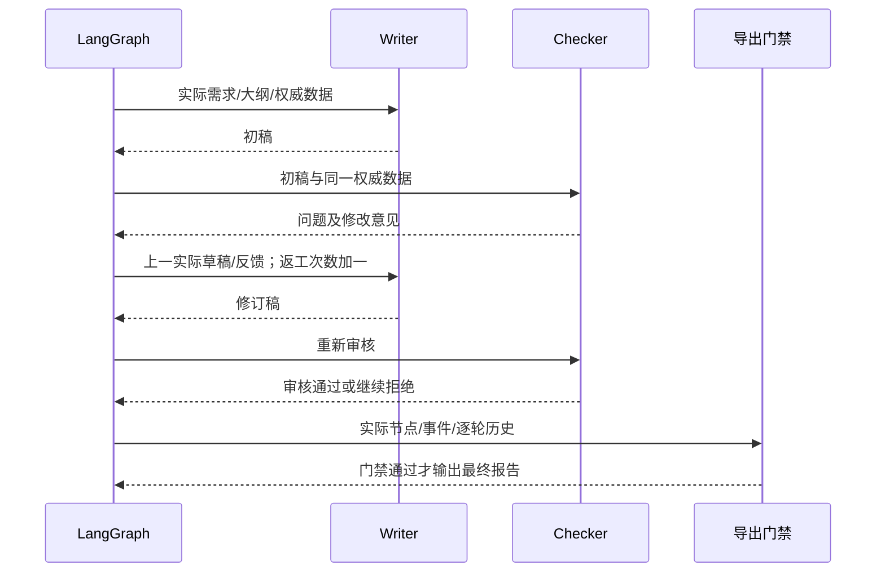
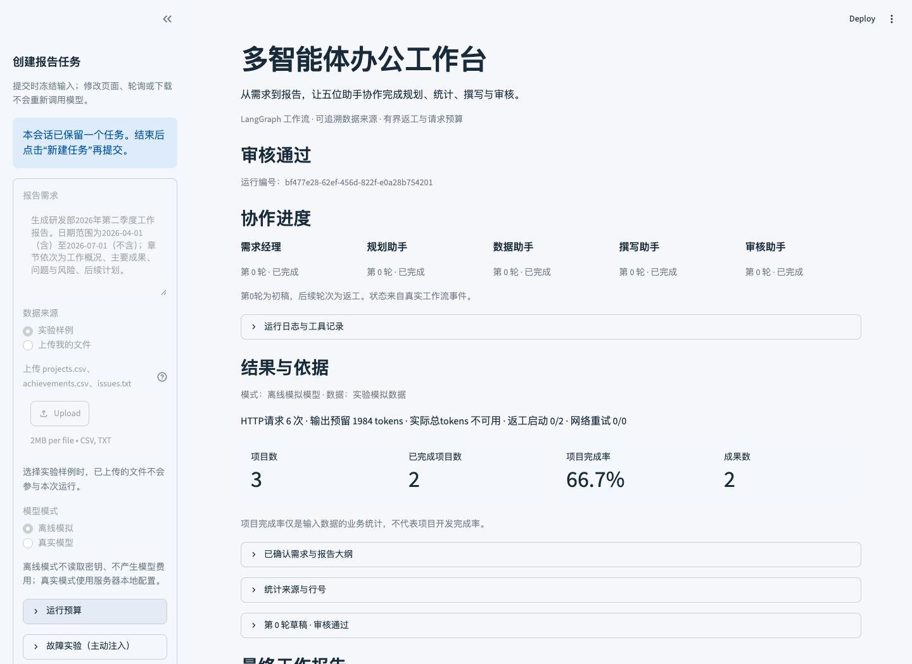
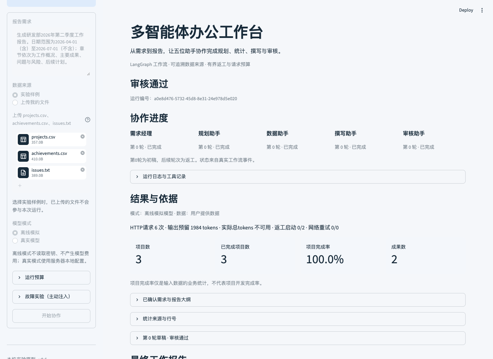
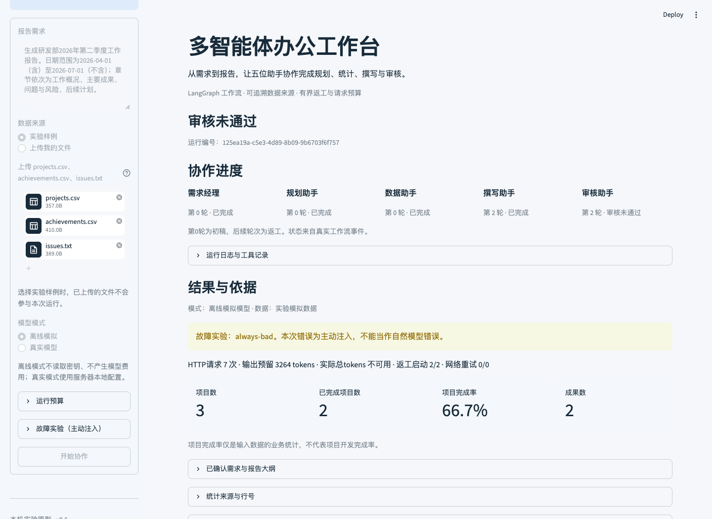
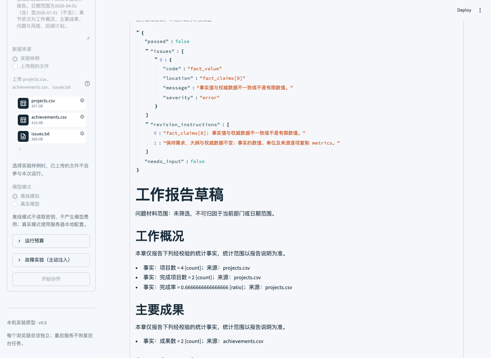

# 多智能体智能办公协作系统实验报告

课程：软件体系结构（研究生）
项目：multi-agent-office-lab
交付版本：v1.0.0（当前课程交付版）
姓名：________________  学号：________________  班级：________________
指导教师：________________  实验日期：2026年10月9日至10日
代码仓库：https://github.com/Thedaiyyds/multi-agent-office-lab

## 一、实验目标与要求依据

本实验实现一个生成部门季度工作报告的多智能体办公系统。用户提交部门、日期范围、章节要求及模拟办公数据，系统依次完成需求解析、大纲规划、数据统计、草稿撰写、审核与有限返工，输出经过审核的Markdown报告及可追溯运行记录。实验重点是软件体系结构中的职责划分、接口约束、通信与调度、异常终止以及可复现交付。

教师补充说明为：“供参考，实际的实验不要求采用openclaw，可以选择任意的开源框架，完成多智能体搭建和工作，三人一组，最终提交实验报告，记录搭建过程和运行截图。”因此，参考指导书中的OpenClaw安装步骤和五人角色安排不作为本项目强制实现要求；本项目选择LangGraph，保留五个业务角色。教师最新的三人组队要求仍然有效。实际开发者是一人，借助三个AI开发角色进行任务分派、实现与交叉审查；该方式不能冒充三名人类组员，也不能据此声明已满足组队人数要求。

用户另要求将项目上传Git，并使每个版本经历独立PR、检查、合并和版本记录。v1.0用于收束既有功能、增加统一离线验收、完成报告和复现材料。Docker、公网发布、账号系统、业务PDF导出、答辩PPT及视频未列入本次交付范围。本报告描述实际完成的软件工作，不代表教师已验收或课程平台已提交。

## 二、方案选型与实际分工

系统采用Python、LangGraph、Pydantic、httpx和Streamlit。LangGraph为MIT许可开源框架，满足教师允许采用开源框架的要求，许可见[官方LICENSE](https://github.com/langchain-ai/langgraph/blob/main/LICENSE)。本项目的StateGraph表达五角色顺序和Checker返回Writer的条件边；Pydantic约束角色结果、业务数据和运行状态；httpx承载兼容Chat Completions的模型调用；Streamlit提供本机中文页面。统计采用本地程序，模型负责需求理解、规划、受约束撰写和语义审核。

这一选择适合规模有限、需要演示执行过程的课程原型。模型服务可由多个角色共用，不需要为五个角色准备五个模型或五台服务器。实际真实服务验证使用用户配置的DeepSeek V4 Pro（模型标识deepseek-v4-pro）；日常回归和本版验收使用明确标记的offline_mock，不发送外部模型请求。依赖以uv.lock为准，不能只凭框架安装成功证明业务协作成功。

| 产品运行角色 | 输入与职责 | 实际输出 |
| --- | --- | --- |
| Manager | 解析用户需求，校验部门和日期原文依据 | Requirements或needs_input |
| Planner | 根据真实需求规划章节及指标归属 | Outline |
| Data | 请求唯一注册工具，执行本地全量验证和统计 | DataAgentResult、指标、来源、异常 |
| Writer | 根据需求、大纲和权威数据生成初稿或修订稿 | Draft、事实声明、建议、固定渲染Markdown |
| Checker | 程序检查优先，再进行模型审核 | Review、问题位置、返工意见 |

五个业务角色是系统运行组件。AI开发角色A/B/C是构建该系统的辅助工作者，两者不能混淆。各版根据依赖调整独占文件范围，主协调者负责统一契约与集成。v1.0中，A负责八场景验收入口，B负责独立发布测试及部署/演示说明，C负责实验报告与架构分析；主协调者负责CLI集成、版本、真实浏览器证据、Word生成与版面检查、完整复现和Git发布。Git沿用实际开发者身份，不制造虚构人类提交者。

## 三、环境搭建与运行过程

开发环境为macOS Apple Silicon。早期实际环境记录为Python 3.12.15、uv 0.12.23、LangGraph 1.2.14；网页版使用Streamlit 1.65.0。项目统一以Python 3.12验收，依赖的确切解析结果见uv.lock。首次安装运行时和依赖需要网络，“离线运行”表示业务执行不连接模型服务。

从仓库获取代码并安装：

```bash
git clone https://github.com/Thedaiyyds/multi-agent-office-lab.git
cd multi-agent-office-lab
uv python install 3.12
uv sync --locked --python 3.12
uv run --locked office-agents graph-demo --output-dir outputs
```

graph-demo实际执行increment→double，输入2得到6，仅用于确认LangGraph安装和图运行，不作为五角色业务证据。正式离线命令为：

```bash
uv run --locked office-agents run --mode mock --request '生成研发部2026年第二季度工作报告。日期范围为2026-04-01（含）至2026-07-01（不含）；章节依次为工作概况、主要成果、问题与风险、后续计划。' --output-dir outputs/demo
uv run --locked streamlit run app.py --server.address 127.0.0.1
```

浏览器默认访问http://127.0.0.1:8501；如果通过--server.port指定其他端口，使用启动输出中的实际地址。页面选择样例或上传三个固定文件，填写需求，按“开始协作”。上传时应等待文件传输完成再提交。页面展示实际角色事件、指标、来源、逐轮审核和最终下载。任务结束后按“新建任务”才可再次接纳；普通重运行和下载不重新执行模型请求。

真实模型为显式可选模式：复制.env.example为本地.env，填写LLM_BASE_URL、LLM_MODEL和LLM_API_KEY；doctor只检查配置，不联网。密钥不进入源码、截图或Git。历史真实探测使用smoke --profile deepseek；完整业务调用使用run --mode live --profile deepseek。报告不要求复现者重复付费调用，既有历史证据可离线核对。

v1.0新增统一验收入口：

```bash
uv run --locked office-agents acceptance --output-dir outputs/acceptance
uv run --locked pytest -q
uv run --locked ruff check .
uv run --locked ruff format --check .
```

该入口只接收输出目录，不提供live参数，不读取模型配置，逐例执行原有图、工具、上传预检和导出；在唯一suite目录内形成JSON索引。预期的needs_input、review_failed和failed只有同时符合停点及无最终报告等条件，才被视为对应验收场景通过。最终执行结果见本报告第七节及docs/validation-v1.0.md。

## 四、版本开发与Git过程

先建立环境与契约，再实现数据工具及独立角色，随后串联工作流、增加有限返工和页面，最后整理统一验收与交付材料。每版先写计划，按独占文件分派AI角色，交叉审查后集成测试，再使用PR合并主线。

| 版本 | 核心成果 | 已归档完整测试 | Git集成 |
| --- | --- | --- | --- |
| v0.1基线 | 环境、模型适配、CLI及两节点图 | 59项 | PR #1 |
| v0.1.1 | DeepSeek低消耗能力探测 | 77项 | PR #2，标签v0.1.1 |
| v0.2.0 | 文件验证、统计、来源与手算矩阵 | 151项 | PR #3 |
| v0.3.0 | 五个独立业务角色 | 305项 | PR #4 |
| v0.4.0 | 真实LangGraph端到端串联与导出门禁 | 402项 | PR #5 |
| v0.5.0 | 两次有界返工、正文约束及独立重试预算 | 504项 | PR #6 |
| v0.6.0 | 中文工作台、上传、后台任务与真实截图 | 574项 | PR #7 |
| v1.0.0 | 统一离线验收、复现说明、最终实验报告 | 待本版最终验收补录 | 本版发布记录待最终确认 |

历史PR地址统一为https://github.com/Thedaiyyds/multi-agent-office-lab/pull/后接编号。v0.1基线未补发未经基线实测的v0.1.0标签，实际首次模型验收标签为v0.1.1。每版数量是当时完整套件，不相加为当前测试总数。v0.6主线合并提交为f4f3a97ac6b707d4f0883e5dad3d1b5324989ca6；各历史实测源提交可能早于文档合并提交，证据索引保留原SHA。

## 五、数据设计与独立手算

数据来自仓库人工模拟材料，不是企业真实办公记录。projects.csv是项目日快照，achievements.csv是成果记录，issues.txt是无结构问题材料。三个文件使用UTF-8；CSV精确校验表头、日期、状态、有限进度数值及冲突记录。completed必须对应progress=100，但进度100不能反推完成状态。部门完整匹配，日期范围统一为开始包含、结束排除。

项目数为所选范围内每个项目最新快照的去重数量。研发部Q2选择2026-04-01≤日期<2026-07-01：P001选6月20日completed快照，而非4月15日active快照；P002为4月1日completed；P003为6月30日active。因此项目3，完成2，完成率2÷3，显示66.7%。P006的7月1日快照被排除。成果A001和A002符合范围，共2项。原文件8条快照不能直接计为8个项目。

| 场景 | 项目数 | 完成数 | 完成率 | 成果数 |
| --- | --- | --- | --- | --- |
| 研发部Q2 | 3 | 2 | 2/3 | 2 |
| 研发部Q1 | 2 | 1 | 1/2 | 1 |
| 市场部Q2 | 1 | 0 | 0 | 1 |
| 财务部Q2无匹配项目 | 0 | 0 | null | 0 |
| 上传改P003为completed/100 | 3 | 3 | 1 | 2 |

无分母完成率为null，不是0。issues.txt缺少可筛选的部门和日期字段，只作为scope=unfiltered的原文材料，不统计问题数，也不归因于研发部Q2。来源记录保存文件SHA256和实际物理行号；研发Q2项目选中projects.csv第3、4、5行，完成引用第3、4行，成果引用achievements.csv第2、3行。修改输入后来源SHA及结果随之变化，便于区分模型文字和确定性事实。

## 六、组件、通信、审核与异常



实际源码将界面、图调度、角色、模型会话、数据工具和导出分开。workflow.py中的StateGraph负责控制路径，agent_schemas.py与workflow_schemas.py定义接口，agents/内实现五角色，agent_runtime.py控制预算，tools/实现统计，workflow_export.py复核与保存。通信通过同一进程中的类型化状态传递，不是五个独立服务互发网络消息。

Manager的实际Requirements传给Planner；实际Outline和DataResult传给Writer；Checker接收实际Draft及不变的权威数据。节点输入输出深拷贝，防止报告角色改写指标来迎合审核。Data只允许调用一次run_data_tools，参数必须严格等于调用方授权的部门与日期，不能由模型指定路径或其他工具。Pydantic拒绝多余字段，角色JSON解析拒绝重复键及非法数值。模型返回“格式正确的JSON”仍要经过业务约束检查。

Checker先验证必需章节、指标完整性、数值、单位、来源及Markdown渲染一致性。完整工作流启用constrained正文：范围说明必须符合允许模板，数字由事实声明固定渲染；建议与历史事实分开，仍需人工判断可行性。程序已经发现错误时不再消耗Checker模型请求；本地通过后才请求模型语义审核，模型认可不能覆盖程序错误。



首次草稿之后最多开始两次Writer返工，revision_count计已开始的尝试，后续调用失败仍计入。达到上限仍不通过为review_failed。需求或数据不足为needs_input；模型、工具、解析、预算或导出故障为failed。以上状态均保存已有记录，不提供最终report.md。错误注入显式标记bad-fact或always-bad并保留原输出，不能作为模型自然犯错证据。

网络重试独立于业务返工，默认关闭；指定超时、连接、429、5xx可在额度内重试，每个逻辑请求最多一次，会话最多两次，每次实际尝试均进入HTTP和输出预留预算。正常五角色需要6个请求，因为Data有工具调用和结果摘要两次往返；正常输出预留1984。两次返工最高10次请求、4032输出预留；加两次最耗输出的Writer重试时硬上限12次HTTP、5568输出预留。预留数不是实际消耗，输入tokens另计，usage缺失记录null。

页面后台线程执行同一原图，开始事件在动作前发布，轮询仅读深拷贝快照。每个Streamlit会话持有自己的RunController；接纳锁防止多次点击，输入冻结为字节，临时数据目录隔离。上传限制三文件白名单、2MiB/文件和业务字段，校验失败发生在任务接纳与模型创建前。导出成功后读取白名单产物字节供下载，失败不展示最终下载。防重保证仅覆盖当前控制器，未实现跨服务器重启或新浏览器会话的持久任务恢复。

## 七、实际验证与运行截图

### 7.1 历史模型与回归证据

| 原版本及实测日期 | 实际内容 | 外部HTTP | 实际总tokens |
| --- | --- | --- | --- |
| v0.1.1，2026-10-09 | 文本、JSON、本地工具往返探测 | 4 | 483 |
| v0.3.0，2026-10-09 | 五独立角色及Checker坏草稿 | 7 | 4811 |
| v0.4.0，2026-10-09 | 初次Manager停止及随后完整链路 | 7 | 4351 |
| v0.5.0，2026-10-09 | 实际注入、拒绝、Writer返工、复审 | 7 | 5775 |
| v0.6.0，2026-10-10 | 574测试及实际浏览器七场景 | 0 | 0付费tokens |

以上均保留原日期和版本，不算作v1.0新增调用。v0.5真实run_id为c20640f6-d1a5-4319-a41b-d54be75415ce，输入4418、输出1357、总5775，业务返工1、网络重试0；输出预留2752不等于实际消耗。初稿项目数原为3，实验人为改为4，程序拒绝后Writer收到了实际坏稿与反馈，修订为3，真实Checker复审后导出。reasoning_tokens未返回，不能写为0。

v0.6完整套件574项通过，并从GitHub新克隆c850e05c93e562a7beda4464aac78f9adf93357b，在无.env且清除模型环境配置后完成锁定安装、Ruff、格式、完整套件及两个mock CLI。AppTest上传使用widget夹具，实际浏览器另验证原生文件传输和下载，不能将两者混为同一种测试。

### 7.2 真实网页截图（明确保留v0.6来源）

以下图均在2026-10-10由实际Chromium浏览器捕获，原尺寸1440×1050，无图片生成或编辑。模式为offline_mock，真实图、工具、审核和导出执行；模型HTTP响应来自本地脚本。统一产品源SHA为ec6af104e52768343918f30c68dc84f87541203b。这些是历史v0.6截图，不重新标记为v1.0新运行。



图1：正常运行completed，项目3、完成2、完成率66.7%、成果2；run_id为bf477e28-62ef-456d-822f-e0a28b754201，6次本地HTTP、返工0。实际浏览器下载字节与该运行report.md一致，下载没有改变可见run_id。



图2：原生上传后，P003改为completed/100，完成数从2变3、完成率100%；run_id为a0e8d476-5732-45d8-8e31-24e978d5e020，data_origin=provided，6次本地HTTP。数据本身仍是修改后的模拟材料，“provided”仅标记从上传入口提供。



图3：持续错误场景在两次返工后review_failed；run_id为125ea19a-c5e3-4d89-8b09-9b6703f6f757，7次本地HTTP，没有最终report.md和最终下载。达到预期失败状态是边界验证成功，不是业务报告成功。



图4：审核详情显示fact_value拒绝及坏稿中的项目数4；run_id为845b3f04-8855-4d88-b742-d737b878e4ef，后续返工一次得到completed，7次本地HTTP。截图不是真实DeepSeek生成错误的证据。

### 7.3 v1.0最终验收记录

本节待主协调者完成本版八场景离线验收、完整套件、真实浏览器截图和GitHub新克隆后，根据docs/validation-v1.0.md与evidence/v1.0实际索引补录数量、SHA、suite_id和run_id。当前不以计划代替完成记录，不提前填写通过数或PR合并结论。本轮不追加真实DeepSeek调用。

## 八、实际问题及解决过程

1. **统计口径容易混淆。** 多个快照不能直接当作项目数；完成率2/3指3个选中项目中2个已完成，而不是整个开发计划只完成2/3。通过独立手算、半开日期边界和原始行号核对固定口径。
2. **真实模型不是每次都按契约返回。** v0.4首次Manager本地校验停止，1次请求、372tokens；未保存原始服务响应，无法确认具体失败字段。后续补强从原文提取的日期提示与安全诊断，并用明确ISO日期完成真实联调，不自动修改错误答案。
3. **指标正确不保证自由叙述可靠。** v0.4真实Writer出现“整体工作按计划推进”“资源分配紧张”等缺乏输入依据的正文，Checker仍认可。v0.5引入严格正文模板、事实声明固定渲染与程序审核，在独立回归中拒绝这类文字；建议仍保留人工评估边界。
4. **页面重运行可能再次提交。** v0.6将任务接纳与图运行放入独立控制器和后台线程，轮询只读；8线程16次重复start只接纳一次。终态reset与新建按钮由状态片段更新，避免页面停留在旧的禁用状态。
5. **新克隆曾出现AppTest首UI超时。** 首次573项通过、1项超时，失败日志保留。后续反复未复现原问题，无法确认原根因；测试生命周期改为主线程预初始化pandas/pyarrow并等待后台任务退出，保留20秒超时和原断言。最终新克隆574项通过，冷初始化栈是后续诊断证据，不应倒推为原失败根因已证明。

## 九、局限、扩展与个人总结

目前是单进程、本机课程原型。未提供跨重启任务恢复、分布式消息队列、用户认证、日志签名或公网运维能力；本地UUID隔离不等于长期持久任务幂等。支持固定CSV/TXT及四项指标，不能直接接收任意Excel、Word或PDF业务数据。issues.txt未筛选，不能自动证明某部门在某季度有哪些问题。正文约束降低幻觉风险，也限制开放叙述；最终建议、业务背景和可行性仍需人工审核。

后续可以在保持契约与审计门禁的前提下，加入可筛选问题表、人工批准节点、持久运行存储、独立任务队列和更多工具；新增数据源应先规定字段、口径、来源与异常规则，再交给模型使用。这里未做30分钟稳定性或生产负载测试，不声称生产就绪。

从本次实际实现可以得到三点认识：一是多智能体工作的关键是明确职责和可验证结果，而不只是定义五个角色名；二是统计与来源应由确定性程序提供，模型审核不能代替业务规则；三是计划、版本、失败日志、真实截图和新克隆复现共同构成可检查交付。AI辅助提高了并行实现和交叉审查效率，也要求协调者明确文件归属、共享契约和证据边界。以上是基于工程记录的总结，不代写未发生的课堂答辩或个人使用感受。

提交人个人补充（请按本人实际学习和操作填写）：____________________________。

## 十、报告依据与附件

可复核依据为仓库源码、uv.lock、各版本plan/review/validation文档、evidence下实际运行JSON及截图。主要附件：docs/report/architecture-analysis.md；docs/deployment-v1.0.md；docs/demo-v1.0.md；docs/submission-v1.0.md；docs/validation-v0.5.md；docs/validation-v0.6.md；evidence/v0.6/browser-acceptance.json。本版最终证据索引以evidence/v1.0和docs/validation-v1.0.md归档的实际结果为准。框架概念参照[LangGraph官方图API文档](https://docs.langchain.com/oss/python/langgraph/graph-api)，传统MAS比较参照[JADE官方技术说明](https://jade.tilab.com/technical-description/)；本项目未实现JADE协议。
